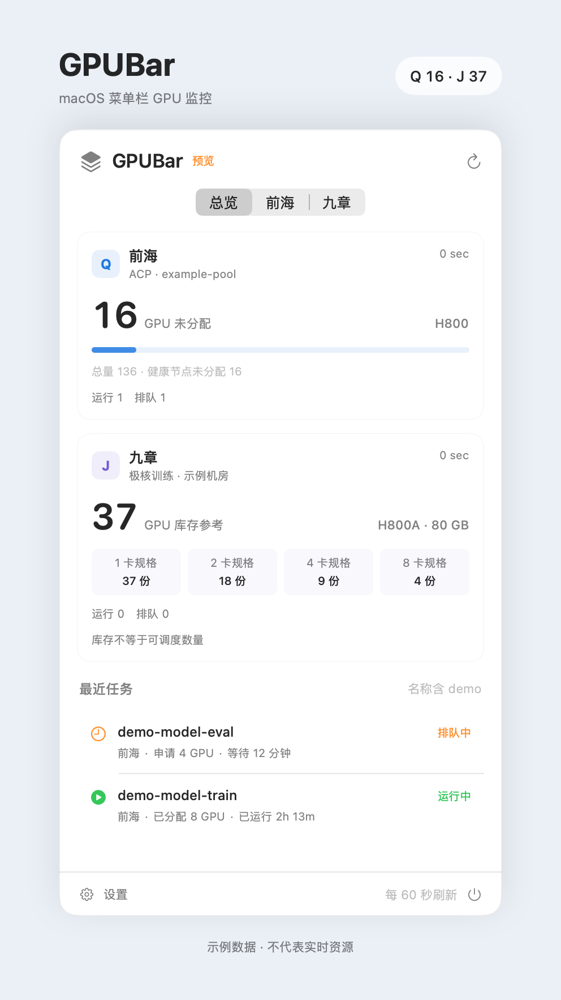

# GPUBar

A native macOS menu bar monitor for Qianhai ACP and Jiuzhang HyperTrain. Track GPU headroom, inventory references, and recent jobs using your own credentials and resource configuration.

GPUBar 在 macOS 菜单栏中显示前海 ACP 的 GPU 未分配余量、九章的规格库存参考，以及最近的训练任务。它是独立的非官方客户端，与两个平台均无隶属关系。

## 界面示例



使用应用原生界面和虚构数据渲染，面板加高以完整展示任务列表。图中数量不代表实时资源。

## 功能

- 菜单栏同时显示两平台摘要，例如 `Q 16 · J 24`。
- 自行配置前海订阅、资源池、工作空间，以及九章智算中心 ID。
- 按名称筛选任务，忽略大小写；默认留空。显示最近 10 个匹配任务，可查看状态、资源、时间和任务 ID。
- 默认每 60 秒刷新，可选 30 秒、2 分钟、5 分钟；支持手动刷新、独立错误提示、过期数据标记和休眠唤醒。
- 可选任务成功／失败通知、登录启动，默认关闭。
- 凭据保存在 macOS 钥匙串；直接查询平台 HTTPS API，不依赖 SSH 或常驻后端。

## 构建与启动

需要 **macOS 15+、Swift 6 工具链和 Apple Command Line Tools**。界面目前为中文。无第三方包依赖。

```sh
git clone https://github.com/haowen-xiong/GPUBar.git
cd GPUBar
./scripts/test.sh
./scripts/package.sh
open dist/GPUBar.app
```

自签名构建的身份可能随重编译变化，钥匙串可能需要重新授权或再次保存凭据；后台读取遇到授权问题时会显示错误。文件型 macOS 钥匙串使用兼容 API 禁止后台授权弹窗，因此编译时会出现相应弃用警告。

构建采用当前 Mac 的处理器架构；本项目已在 Apple Silicon 上验证，Intel 尚未实机验证。`package.sh` 使用本机 ad hoc 签名，不包含 Developer ID 签名或 Apple 公证。可将应用移到 Applications 后启动；菜单栏入口为 `Q — · J —`。在入口中点“设置”完成配置。

## 首次配置

两个平台可以只配置其中一个。每个平台都需要**自己的凭据和资源范围**；未配置的平台不会发出查询。

### 前海 ACP

在“前海 ACP 资源范围”中填写：

| 字段 | 含义 |
|---|---|
| 订阅 ID | 自己账号可访问的 subscription ID |
| 资源组 | 资源所在的 resource group，默认 `default` |
| 节点可用区 | ACP 资源池所在可用区，默认 `cn-sz-01a` |
| 任务可用区 | ACP 工作空间所在可用区，默认 `cn-sz-01z` |
| 资源池标识 | API 中的资源池名称；不一定等同于控制台显示名称 |
| 工作空间标识 | 训练任务所属 workspace |

从已有任务配置或平台控制台获取这些标识，保存监控设置，再在“平台凭据”中输入 Access Key 和 Secret Key。

当前适配器连接前海深圳接口 `aec2.cn-sz-01.qhsgaiccapi.com`，使用 HMAC 签名；它只监控 ACP，不统计 CCI。其他地域、不同 API 部署或不同授权机制尚未验证。

### 九章

在“九章智算中心”中填写自己账号可访问的 **`aidcId`**；显示名称可选，仅用于标注。保存后配置九章 Access Key 和 Secret Key。

智算中心 ID 应以自己的平台目录为准，可参考[智算中心列表 API](https://docs.alayanew.com/en/docs/api-reference/aidc)。当前适配器使用 `api.alayanew.com/api/osm/v1/` 的 HMAC AK/SK 接口；仅有 Bearer API Key 的账号不能直接使用此实现。

## 数字的含义

| 平台 | 摘要含义 | 限制 |
|---|---|---|
| 前海 Q | 健康、启用节点的 GPU 容量减去已分配量 | CPU、内存、节点碎片、任务条件仍会影响调度 |
| 九章 J | 所选机房唯一 1 卡规格的 `remainingCount` | **库存参考，不是已验证的可调度卡数** |

九章的 1／2／4／8 卡规格可能共享库存，不能相加；没有唯一 1 卡规格、库存字段缺失或平台报告库存异常时，摘要显示 `—`。完整规格库存可在面板中查看。

即使库存大于任务所需卡数，故障节点、禁止调度、CPU／内存不足、配额、优先级或多节点同时启动条件仍可能阻止任务运行。GPUBar 当前不查询整个九章集群的节点健康情况，也不推算“实际可调度 GPU 总数”。

任务匹配仅使用前海 `display_name`、九章 `name`。名称不代表资源归属。前海运行任务会查询 Worker 确认实际分配量；无法确认时显示“申请”。九章显示申请量。这里显示的是平台状态和时间，不提供训练 step、loss 或完成百分比。

## 刷新与本地数据

- 资源和任务独立更新，两个平台互不阻塞。失败时保留最后成功数据，显示错误；自动重试逐步延迟，最长 15 分钟。
- 打开面板时数据超过 15 秒会刷新。休眠时停止轮询，唤醒或网络恢复后刷新；网络请求有超时和分页完整性检查。
- 切换资源范围后清空旧范围缓存；修改筛选词后重新读取任务。
- 通知仅针对本次运行中观察到的成功／失败状态变化，不批量通知历史结果。资源阈值通知和 iPhone 客户端尚未提供。

| 数据 | 存放位置 |
|---|---|
| AK/SK | macOS 钥匙串，服务 `io.github.haowen-xiong.GPUBar.platform-credentials` |
| 资源范围、筛选、刷新设置 | `com.haowen.GPUBar` 的 UserDefaults |
| 最近成功快照 | `~/Library/Application Support/GPUBar/snapshots.json`，权限 600 |

应用只发送平台查询请求，不提交、修改或停止云任务。资源标识不是密码，但可能暴露账号环境；发布 issue、截图或日志前请移除私人信息。不要上传钥匙串数据、真实配置或运行快照。

## 开发与诊断

```sh
# 界面预览：模拟数据，不访问平台或写入配置。
open dist/GPUBar.app --args --preview

# 用普通窗口查看总览，便于调试。
open dist/GPUBar.app --args --dashboard

# 从钥匙串和本机设置发起只读查询。
# 输出包含任务信息，不要直接发布到公开 issue。
dist/GPUBar.app/Contents/MacOS/GPUBar --probe
```

切换启动参数前先退出正在运行的 GPUBar。可用 `GPUBAR_BUILD_DIR` 指定构建缓存目录；`package.sh` 第一个参数指定应用输出目录。

也可以用 JSON 导入资源范围。示例中的标识均为虚构值，需替换成本机配置；`*.local.json` 已被 Git 忽略。

```sh
cp examples/config.example.json config.local.json
# 编辑 config.local.json，然后导入：
dist/GPUBar.app/Contents/MacOS/GPUBar --import-config < config.local.json
```

凭据建议在设置中输入。自动化场景的 `--import-credentials` 从标准输入读取 `{ "qianhai": { "accessKey": "…", "secretKey": "…" }, "jiuzhang": { "accessKey": "…", "secretKey": "…" } }`，不从命令行参数读取秘密。不要将真实凭据写入源码、提交历史或日志。

`./scripts/test.sh` 运行无网络、无凭据的独立 Swift 检查程序，不依赖 XCTest。检查覆盖签名、时区、筛选、配置校验、范围隔离、共享库存、库存异常、健康节点统计、GPU 别名、多节点申请和分页失败。GitHub Actions 会执行这些检查并构建应用。

## 贡献与许可

欢迎通过 issue 或 pull request 提交问题和改进。请提供 macOS／Swift 版本、复现步骤及脱敏错误信息；新接口或资源计量逻辑应附上虚构的响应样例和相应检查。

界面组织参考 [CodexBar](https://github.com/steipete/CodexBar) 的菜单栏监控方式；本仓库没有包含其源码或素材。平台字段可参考[九章规格接口](https://docs.alayanew.com/en/docs/api-reference/distributed-training/product-list)。API 可能发生变化，未覆盖的平台版本不保证兼容。

[MIT License](LICENSE) · Copyright © 2026 Haowen Xiong
